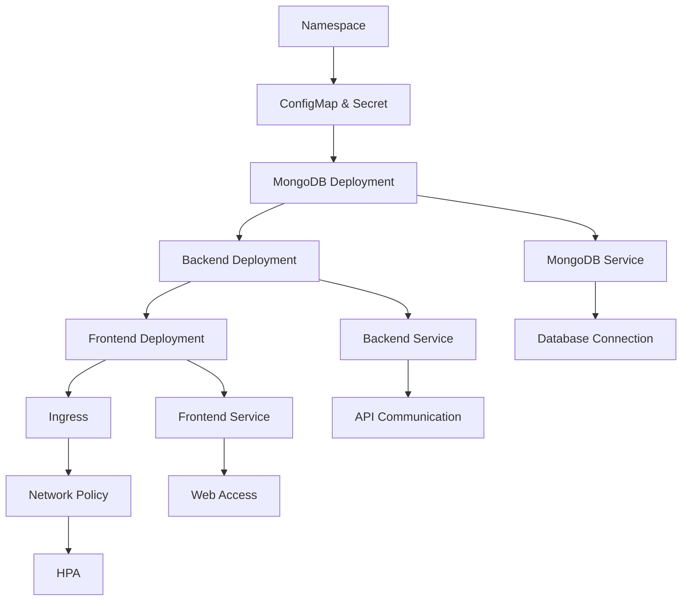

# Kubernetes Manifests Guide: Understanding and Customizing for Any Application

This guide explains all the Kubernetes manifests in the `k8s/` directory, their purposes, how they connect, and how to customize them for any application.

## **Table of Contents**

1. [Namespace](#namespace)
2. [ConfigMap](#configmap)
3. [Secret](#secret)
4. [MongoDB Deployment](#mongodb-deployment)
5. [Backend Deployment](#backend-deployment)
6. [Frontend Deployment](#frontend-deployment)
7. [Ingress](#ingress)
8. [Network Policy](#network-policy)
9. [Horizontal Pod Autoscaler](#horizontal-pod-autoscaler)
10. [Deployment Script](#deployment-script)
11. [How Everything Connects](#how-everything-connects)
12. [Customization Guide](#customization-guide)

---

## **1. Namespace**

**File:** `namespace.yaml`

```yaml
apiVersion: v1
kind: Namespace
metadata:
  name: gigmatch
  labels:
    name: gigmatch
```

### **Purpose:**
- **Logical isolation** of your application resources
- **Resource management** and quotas
- **Security boundaries** and access control
- **Organizational structure** for multiple applications

### **How to Customize:**
```yaml
apiVersion: v1
kind: Namespace
metadata:
  name: your-app-name
  labels:
    name: your-app-name
    environment: production
    team: your-team
```

### **Best Practices:**
- Use descriptive names (e.g., `myapp-prod`, `myapp-staging`)
- Add labels for organization and filtering
- Consider using namespaces for different environments

---

## **2. ConfigMap**

**File:** `configMap.yaml`

```yaml
apiVersion: v1
kind: ConfigMap
metadata:
  name: gigmatch-config
  namespace: gigmatch
data:
  NODE_ENV: development
  FRONTEND_URL: http://localhost:3000
  PORT: "5000"
  REACT_APP_API_URL: "http://gigmatch-backend:5000/api"
```

### **Purpose:**
- **Store non-sensitive configuration** data
- **Environment-specific settings** (dev, staging, prod)
- **Application configuration** that can be changed without rebuilding images
- **Share configuration** across multiple pods

### **How to Customize:**
```yaml
apiVersion: v1
kind: ConfigMap
metadata:
  name: your-app-config
  namespace: your-app-name
data:
  # Application-specific configs
  APP_NAME: "Your App"
  API_VERSION: "v1"
  LOG_LEVEL: "info"
  
  # Database configs
  DB_HOST: "your-db-service"
  DB_PORT: "5432"
  
  # External service URLs
  EXTERNAL_API_URL: "https://api.external.com"
  
  # Feature flags
  ENABLE_FEATURE_X: "true"
  ENABLE_FEATURE_Y: "false"
```

### **Best Practices:**
- Use descriptive key names
- Group related configurations
- Keep sensitive data in Secrets, not ConfigMaps
- Use environment-specific ConfigMaps

---

## **3. Secret**

**File:** `secret.yaml`

```yaml
apiVersion: v1
kind: Secret
metadata:
  name: gigmatch-secret
  namespace: gigmatch
type: Opaque
data:
  MONGODB_URI: bW9uZ29kYjovL21vbmdvZGI6MjcwMTcvZ2lnbWF0Y2g=
  JWT_SECRET: eW91ci1zZWNyZXQta2V5
```

### **Purpose:**
- **Store sensitive data** (passwords, API keys, tokens)
- **Secure credential management**
- **Base64 encoded** for storage
- **Mountable** as files or environment variables

### **How to Customize:**
```yaml
apiVersion: v1
kind: Secret
metadata:
  name: your-app-secrets
  namespace: your-app-name
type: Opaque
data:
  # Database credentials
  DB_PASSWORD: <base64-encoded-password>
  DB_USERNAME: <base64-encoded-username>
  
  # API keys
  STRIPE_SECRET_KEY: <base64-encoded-key>
  AWS_ACCESS_KEY: <base64-encoded-key>
  
  # Application secrets
  JWT_SECRET: <base64-encoded-secret>
  SESSION_SECRET: <base64-encoded-secret>
  
  # External service credentials
  EMAIL_PASSWORD: <base64-encoded-password>
  SMS_API_KEY: <base64-encoded-key>
```

### **Creating Base64 Encoded Values:**
```bash
# Encode a value
echo -n "your-secret-value" | base64

# Decode a value (for verification)
echo "eW91ci1zZWNyZXQta2V5" | base64 -d
```

### **Best Practices:**
- Never commit secrets to Git (use external secret management)
- Rotate secrets regularly
- Use different secrets for different environments
- Consider using external secret operators (Sealed Secrets, External Secrets)

---

## **4. MongoDB Deployment**

**File:** `mongodb-deployment.yaml`

```yaml
apiVersion: apps/v1
kind: Deployment
metadata:
  name: mongodb
  namespace: gigmatch
  labels:
    app: mongodb
spec:
  replicas: 1
  selector:
    matchLabels:
      app: mongodb
  template:
    metadata:
      labels:
        app: mongodb
    spec:
      containers:
      - name: mongodb
        image: mongo:6
        ports:
        - containerPort: 27017
        env:
        - name: MONGO_INITDB_DATABASE
          value: "gigmatch"
        resources:
          requests:
            memory: "256Mi"
            cpu: "250m"
          limits:
            memory: "512Mi"
            cpu: "500m"
        volumeMounts:
        - name: mongodb-data
          mountPath: /data/db
      volumes:
      - name: mongodb-data
        persistentVolumeClaim:
          claimName: mongodb-pvc
---
apiVersion: v1
kind: Service
metadata:
  name: mongodb
  namespace: gigmatch
spec:
  selector:
    app: mongodb
  ports:
  - port: 27017
    targetPort: 27017
  type: ClusterIP
---
apiVersion: v1
kind: PersistentVolumeClaim
metadata:
  name: mongodb-pvc
  namespace: gigmatch
spec:
  accessModes:
    - ReadWriteOnce
  resources:
    requests:
      storage: 1Gi
```

### **Purpose:**
- **Database deployment** with persistent storage
- **Service discovery** for other pods to connect
- **Data persistence** across pod restarts
- **Resource management** and limits

### **How to Customize for Different Databases:**

#### **PostgreSQL:**
```yaml
apiVersion: apps/v1
kind: Deployment
metadata:
  name: postgresql
  namespace: your-app-name
spec:
  replicas: 1
  selector:
    matchLabels:
      app: postgresql
  template:
    metadata:
      labels:
        app: postgresql
    spec:
      containers:
      - name: postgresql
        image: postgres:15
        ports:
        - containerPort: 5432
        env:
        - name: POSTGRES_DB
          value: "your_app_db"
        - name: POSTGRES_USER
          valueFrom:
            secretKeyRef:
              name: your-app-secrets
              key: DB_USERNAME
        - name: POSTGRES_PASSWORD
          valueFrom:
            secretKeyRef:
              name: your-app-secrets
              key: DB_PASSWORD
        volumeMounts:
        - name: postgresql-data
          mountPath: /var/lib/postgresql/data
      volumes:
      - name: postgresql-data
        persistentVolumeClaim:
          claimName: postgresql-pvc
```

#### **MySQL:**
```yaml
apiVersion: apps/v1
kind: Deployment
metadata:
  name: mysql
  namespace: your-app-name
spec:
  replicas: 1
  selector:
    matchLabels:
      app: mysql
  template:
    metadata:
      labels:
        app: mysql
    spec:
      containers:
      - name: mysql
        image: mysql:8.0
        ports:
        - containerPort: 3306
        env:
        - name: MYSQL_DATABASE
          value: "your_app_db"
        - name: MYSQL_ROOT_PASSWORD
          valueFrom:
            secretKeyRef:
              name: your-app-secrets
              key: MYSQL_ROOT_PASSWORD
        volumeMounts:
        - name: mysql-data
          mountPath: /var/lib/mysql
      volumes:
      - name: mysql-data
        persistentVolumeClaim:
          claimName: mysql-pvc
```

### **Best Practices:**
- Use specific image tags (not `latest`)
- Set appropriate resource limits
- Use persistent storage for data
- Consider using managed database services (RDS, Cloud SQL)
- Implement backup strategies

---

## **5. Backend Deployment**

**File:** `backend-deployment.yaml`

```yaml
apiVersion: apps/v1
kind: Deployment
metadata:
  name: gigmatch-backend
  namespace: gigmatch
  labels:
    app: gigmatch-backend
spec:
  replicas: 2
  selector:
    matchLabels:
      app: gigmatch-backend
  template:
    metadata:
      labels:
        app: gigmatch-backend
    spec:
      containers:
      - name: backend
        image: runtesting/gigmatch-backend:latest
        ports:
        - containerPort: 5000
        env:
        - name: MONGODB_URI
          valueFrom:
            secretKeyRef:
              name: gigmatch-secret
              key: MONGODB_URI
        - name: JWT_SECRET
          valueFrom:
            secretKeyRef:
              name: gigmatch-secret
              key: JWT_SECRET
        - name: NODE_ENV
          valueFrom:
            configMapKeyRef:
              name: gigmatch-config
              key: NODE_ENV
        - name: PORT
          valueFrom:
            configMapKeyRef:
              name: gigmatch-config
              key: PORT
        resources:
          requests:
            memory: "256Mi"
            cpu: "250m"
          limits:
            memory: "512Mi"
            cpu: "500m"
        livenessProbe:
          httpGet:
            path: /api/health
            port: 5000
          initialDelaySeconds: 30
          periodSeconds: 10
        readinessProbe:
          httpGet:
            path: /api/health
            port: 5000
          initialDelaySeconds: 5
          periodSeconds: 5
---
apiVersion: v1
kind: Service
metadata:
  name: gigmatch-backend
  namespace: gigmatch
spec:
  selector:
    app: gigmatch-backend
  ports:
  - port: 5000
    targetPort: 5000
  type: ClusterIP
```

### **Purpose:**
- **API server deployment** with multiple replicas
- **Health checks** for reliability
- **Environment configuration** from ConfigMaps and Secrets
- **Service exposure** for internal communication

### **How to Customize for Different Backends:**

#### **Python/Flask:**
```yaml
apiVersion: apps/v1
kind: Deployment
metadata:
  name: your-app-backend
  namespace: your-app-name
spec:
  replicas: 3
  selector:
    matchLabels:
      app: your-app-backend
  template:
    metadata:
      labels:
        app: your-app-backend
    spec:
      containers:
      - name: backend
        image: your-registry/your-app-backend:v1.0.0
        ports:
        - containerPort: 8000
        env:
        - name: DATABASE_URL
          valueFrom:
            secretKeyRef:
              name: your-app-secrets
              key: DATABASE_URL
        - name: SECRET_KEY
          valueFrom:
            secretKeyRef:
              name: your-app-secrets
              key: SECRET_KEY
        - name: FLASK_ENV
          valueFrom:
            configMapKeyRef:
              name: your-app-config
              key: FLASK_ENV
        resources:
          requests:
            memory: "512Mi"
            cpu: "500m"
          limits:
            memory: "1Gi"
            cpu: "1000m"
        livenessProbe:
          httpGet:
            path: /health
            port: 8000
          initialDelaySeconds: 30
          periodSeconds: 10
        readinessProbe:
          httpGet:
            path: /ready
            port: 8000
          initialDelaySeconds: 5
          periodSeconds: 5
```

#### **Java/Spring Boot:**
```yaml
apiVersion: apps/v1
kind: Deployment
metadata:
  name: your-app-backend
  namespace: your-app-name
spec:
  replicas: 2
  selector:
    matchLabels:
      app: your-app-backend
  template:
    metadata:
      labels:
        app: your-app-backend
    spec:
      containers:
      - name: backend
        image: your-registry/your-app-backend:latest
        ports:
        - containerPort: 8080
        env:
        - name: SPRING_DATASOURCE_URL
          valueFrom:
            secretKeyRef:
              name: your-app-secrets
              key: DATABASE_URL
        - name: SPRING_PROFILES_ACTIVE
          valueFrom:
            configMapKeyRef:
              name: your-app-config
              key: SPRING_PROFILES_ACTIVE
        resources:
          requests:
            memory: "1Gi"
            cpu: "500m"
          limits:
            memory: "2Gi"
            cpu: "1000m"
        livenessProbe:
          httpGet:
            path: /actuator/health
            port: 8080
          initialDelaySeconds: 60
          periodSeconds: 10
```

### **Best Practices:**
- Use health check endpoints
- Set appropriate resource limits
- Use rolling updates for zero-downtime deployments
- Implement proper logging and monitoring
- Use image pull policies appropriately

---

## **6. Frontend Deployment**

**File:** `frontend-deployment.yaml`

```yaml
apiVersion: apps/v1
kind: Deployment
metadata:
  name: gigmatch-frontend
  namespace: gigmatch
  labels:
    app: gigmatch-frontend
spec:
  replicas: 2
  selector:
    matchLabels:
      app: gigmatch-frontend
  template:
    metadata:
      labels:
        app: gigmatch-frontend
    spec:
      containers:
      - name: frontend
        image: runtesting/gigmatch-frontend:latest
        ports:
        - containerPort: 80
        env:
        - name: REACT_APP_API_URL
          valueFrom:
            configMapKeyRef:
              name: gigmatch-config
              key: REACT_APP_API_URL
        - name: NODE_ENV
          valueFrom:
            configMapKeyRef:
              name: gigmatch-config
              key: NODE_ENV
        resources:
          requests:
            memory: "128Mi"
            cpu: "100m"
          limits:
            memory: "256Mi"
            cpu: "200m"
        livenessProbe:
          httpGet:
            path: /
            port: 80
          initialDelaySeconds: 30
          periodSeconds: 10
        readinessProbe:
          httpGet:
            path: /
            port: 80
          initialDelaySeconds: 5
          periodSeconds: 5
---
apiVersion: v1
kind: Service
metadata:
  name: gigmatch-frontend
  namespace: gigmatch
spec:
  selector:
    app: gigmatch-frontend
  ports:
  - port: 80
    targetPort: 80
  type: ClusterIP
```

### **Purpose:**
- **Web application deployment** with multiple replicas
- **Static file serving** (React, Vue, Angular)
- **Environment configuration** for API endpoints
- **Load balancing** across replicas

### **How to Customize for Different Frontends:**

#### **Vue.js:**
```yaml
apiVersion: apps/v1
kind: Deployment
metadata:
  name: your-app-frontend
  namespace: your-app-name
spec:
  replicas: 3
  selector:
    matchLabels:
      app: your-app-frontend
  template:
    metadata:
      labels:
        app: your-app-frontend
    spec:
      containers:
      - name: frontend
        image: your-registry/your-app-frontend:latest
        ports:
        - containerPort: 80
        env:
        - name: VUE_APP_API_URL
          valueFrom:
            configMapKeyRef:
              name: your-app-config
              key: VUE_APP_API_URL
        - name: VUE_APP_ENVIRONMENT
          valueFrom:
            configMapKeyRef:
              name: your-app-config
              key: NODE_ENV
        resources:
          requests:
            memory: "128Mi"
            cpu: "100m"
          limits:
            memory: "256Mi"
            cpu: "200m"
```

#### **Angular:**
```yaml
apiVersion: apps/v1
kind: Deployment
metadata:
  name: your-app-frontend
  namespace: your-app-name
spec:
  replicas: 2
  selector:
    matchLabels:
      app: your-app-frontend
  template:
    metadata:
      labels:
        app: your-app-frontend
    spec:
      containers:
      - name: frontend
        image: your-registry/your-app-frontend:latest
        ports:
        - containerPort: 80
        env:
        - name: API_BASE_URL
          valueFrom:
            configMapKeyRef:
              name: your-app-config
              key: API_BASE_URL
        - name: ENVIRONMENT
          valueFrom:
            configMapKeyRef:
              name: your-app-config
              key: NODE_ENV
        resources:
          requests:
            memory: "256Mi"
            cpu: "200m"
          limits:
            memory: "512Mi"
            cpu: "500m"
```

### **Best Practices:**
- Use CDN for static assets in production
- Implement proper caching headers
- Use health checks for reliability
- Consider using a CDN or edge caching

---

## **7. Ingress**

**File:** `ingress.yaml`

```yaml
apiVersion: networking.k8s.io/v1
kind: Ingress
metadata:
  name: gigmatch-ingress
  namespace: gigmatch
  annotations:
    nginx.ingress.kubernetes.io/rewrite-target: /
    nginx.ingress.kubernetes.io/ssl-redirect: "false"
spec:
  ingressClassName: nginx
  rules:
  - host: gigmatch.local
    http:
      paths:
      - path: /
        pathType: Prefix
        backend:
          service:
            name: gigmatch-frontend
            port:
              number: 80
      - path: /api
        pathType: Prefix
        backend:
          service:
            name: gigmatch-backend
            port:
              number: 5000
```

### **Purpose:**
- **External access** to your application
- **URL routing** and path-based routing
- **SSL/TLS termination**
- **Load balancing** at the HTTP level

### **How to Customize:**

#### **Multiple Domains:**
```yaml
apiVersion: networking.k8s.io/v1
kind: Ingress
metadata:
  name: your-app-ingress
  namespace: your-app-name
  annotations:
    nginx.ingress.kubernetes.io/rewrite-target: /
    cert-manager.io/cluster-issuer: "letsencrypt-prod"
spec:
  ingressClassName: nginx
  tls:
  - hosts:
    - your-app.com
    - www.your-app.com
    secretName: your-app-tls
  rules:
  - host: your-app.com
    http:
      paths:
      - path: /
        pathType: Prefix
        backend:
          service:
            name: your-app-frontend
            port:
              number: 80
      - path: /api
        pathType: Prefix
        backend:
          service:
            name: your-app-backend
            port:
              number: 8080
  - host: admin.your-app.com
    http:
      paths:
      - path: /
        pathType: Prefix
        backend:
          service:
            name: your-app-admin
            port:
              number: 80
```

#### **API Versioning:**
```yaml
apiVersion: networking.k8s.io/v1
kind: Ingress
metadata:
  name: your-app-ingress
  namespace: your-app-name
spec:
  ingressClassName: nginx
  rules:
  - host: api.your-app.com
    http:
      paths:
      - path: /v1
        pathType: Prefix
        backend:
          service:
            name: your-app-api-v1
            port:
              number: 8080
      - path: /v2
        pathType: Prefix
        backend:
          service:
            name: your-app-api-v2
            port:
              number: 8080
```

### **Best Practices:**
- Use SSL/TLS certificates
- Implement proper security headers
- Use rate limiting for APIs
- Consider using API gateways for complex routing

---

## **8. Network Policy**

**File:** `network-policy.yaml`

```yaml
apiVersion: networking.k8s.io/v1
kind: NetworkPolicy
metadata:
  name: gigmatch-network-policy
  namespace: gigmatch
spec:
  podSelector:
    matchLabels:
      app: gigmatch
  policyTypes:
  - Ingress
  - Egress
  ingress:
  - from:
    - namespaceSelector:
        matchLabels:
          name: ingress-nginx
    ports:
    - protocol: TCP
      port: 80
    - protocol: TCP
      port: 5000
  egress:
  - to:
    - podSelector:
        matchLabels:
          app: mongodb
    ports:
    - protocol: TCP
      port: 27017
```

### **Purpose:**
- **Network security** and isolation
- **Pod-to-pod communication** control
- **Security policies** enforcement
- **Microsegmentation** within the cluster

### **How to Customize:**

#### **Strict Security Policy:**
```yaml
apiVersion: networking.k8s.io/v1
kind: NetworkPolicy
metadata:
  name: your-app-network-policy
  namespace: your-app-name
spec:
  podSelector:
    matchLabels:
      app: your-app
  policyTypes:
  - Ingress
  - Egress
  ingress:
  - from:
    - namespaceSelector:
        matchLabels:
          name: ingress-nginx
    ports:
    - protocol: TCP
      port: 80
    - protocol: TCP
      port: 8080
  egress:
  - to:
    - podSelector:
        matchLabels:
          app: your-app-database
    ports:
    - protocol: TCP
      port: 5432
  - to:
    - namespaceSelector:
        matchLabels:
          name: kube-system
    ports:
    - protocol: UDP
      port: 53
  - to: []
    ports:
    - protocol: TCP
      port: 443
    - protocol: TCP
      port: 80
```

### **Best Practices:**
- Follow the principle of least privilege
- Test network policies thoroughly
- Document allowed communication patterns
- Use namespace labels for organization

---

## **9. Horizontal Pod Autoscaler**

**File:** `hpa.yaml`

```yaml
apiVersion: autoscaling/v2
kind: HorizontalPodAutoscaler
metadata:
  name: gigmatch-backend-hpa
  namespace: gigmatch
spec:
  scaleTargetRef:
    apiVersion: apps/v1
    kind: Deployment
    name: gigmatch-backend
  minReplicas: 2
  maxReplicas: 10
  metrics:
  - type: Resource
    resource:
      name: cpu
      target:
        type: Utilization
        averageUtilization: 70
  - type: Resource
    resource:
      name: memory
      target:
        type: Utilization
        averageUtilization: 80
```

### **Purpose:**
- **Automatic scaling** based on resource usage
- **Performance optimization** during high load
- **Cost optimization** during low load
- **High availability** maintenance

### **How to Customize:**

#### **Custom Metrics:**
```yaml
apiVersion: autoscaling/v2
kind: HorizontalPodAutoscaler
metadata:
  name: your-app-hpa
  namespace: your-app-name
spec:
  scaleTargetRef:
    apiVersion: apps/v1
    kind: Deployment
    name: your-app-backend
  minReplicas: 3
  maxReplicas: 20
  metrics:
  - type: Resource
    resource:
      name: cpu
      target:
        type: Utilization
        averageUtilization: 60
  - type: Resource
    resource:
      name: memory
      target:
        type: Utilization
        averageUtilization: 70
  - type: Object
    object:
      metric:
        name: requests-per-second
      describedObject:
        apiVersion: networking.k8s.io/v1
        kind: Ingress
        name: your-app-ingress
      target:
        type: Value
        value: 1000
```

### **Best Practices:**
- Set appropriate min/max replicas
- Monitor scaling behavior
- Use custom metrics when needed
- Test scaling under load

---

## **10. Deployment Script**

**File:** `deploy-script.sh`

```bash
#!/bin/bash
set -e

echo "Deploying GigMatch to Kubernetes..."

# Create namespace
kubectl apply -f namespace.yaml

# Apply secrets and configs
kubectl apply -f configMap.yaml
kubectl apply -f secret.yaml

# Deploy MongoDB
kubectl apply -f mongodb-deployment.yaml

# Wait for MongoDB to be ready
kubectl wait --for=condition=ready pod -l app=mongodb -n gigmatch --timeout=300s

# Deploy backend
kubectl apply -f backend-deployment.yaml

# Deploy frontend
kubectl apply -f frontend-deployment.yaml

# Apply ingress and network policies
kubectl apply -f ingress.yaml
kubectl apply -f network-policy.yaml
kubectl apply -f hpa.yaml

echo "Deployment complete!"
echo "Access your app at: http://gigmatch.local"
```

### **Purpose:**
- **Automated deployment** process
- **Dependency management** (deploy in correct order)
- **Health checks** and readiness waits
- **Error handling** and rollback capabilities

### **How to Customize:**

#### **Advanced Deployment Script:**
```bash
#!/bin/bash
set -e

# Configuration
NAMESPACE="your-app-name"
ENVIRONMENT="${1:-development}"

echo "Deploying Your App to Kubernetes..."
echo "Environment: $ENVIRONMENT"
echo "Namespace: $NAMESPACE"

# Function to check if namespace exists
check_namespace() {
    if ! kubectl get namespace $NAMESPACE >/dev/null 2>&1; then
        echo "Creating namespace $NAMESPACE..."
        kubectl create namespace $NAMESPACE
    fi
}

# Function to apply manifests with error handling
apply_manifest() {
    local file=$1
    local description=$2
    
    echo "Applying $description..."
    if kubectl apply -f $file; then
        echo "✅ $description applied successfully"
    else
        echo "❌ Failed to apply $description"
        exit 1
    fi
}

# Function to wait for deployment
wait_for_deployment() {
    local deployment=$1
    local timeout=${2:-300}
    
    echo "Waiting for $deployment to be ready..."
    if kubectl wait --for=condition=available deployment/$deployment -n $NAMESPACE --timeout=${timeout}s; then
        echo "✅ $deployment is ready"
    else
        echo "❌ $deployment failed to become ready"
        kubectl describe deployment $deployment -n $NAMESPACE
        exit 1
    fi
}

# Main deployment process
check_namespace

# Apply configuration
apply_manifest "configMap-$ENVIRONMENT.yaml" "ConfigMap"
apply_manifest "secret-$ENVIRONMENT.yaml" "Secrets"

# Deploy database
apply_manifest "database-deployment.yaml" "Database"
wait_for_deployment "database" 600

# Deploy backend
apply_manifest "backend-deployment.yaml" "Backend"
wait_for_deployment "backend" 300

# Deploy frontend
apply_manifest "frontend-deployment.yaml" "Frontend"
wait_for_deployment "frontend" 300

# Apply networking
apply_manifest "ingress.yaml" "Ingress"
apply_manifest "network-policy.yaml" "Network Policy"
apply_manifest "hpa.yaml" "Horizontal Pod Autoscaler"

# Health check
echo "Performing health check..."
sleep 30
if kubectl get pods -n $NAMESPACE | grep -q "Running"; then
    echo "✅ All pods are running"
else
    echo "❌ Some pods are not running"
    kubectl get pods -n $NAMESPACE
    exit 1
fi

echo "🎉 Deployment complete!"
echo "Access your app at: https://your-app.com"
```

### **Best Practices:**
- Add error handling and rollback
- Use environment-specific configurations
- Implement health checks
- Add logging and monitoring
- Use GitOps for production deployments

---

## **11. How Everything Connects**

### **Deployment Order and Dependencies:**



### **Service Communication Flow:**

1. **User External Request** → **Ingress** → **Frontend Service** → **Frontend Pods**
2. **Frontend** → **Backend Service** → **Backend Pods**
3. **Backend** → **MongoDB Service** → **MongoDB Pod**

### **Configuration Flow:**

1. **ConfigMap** → **Environment Variables** → **Application Configuration**
2. **Secret** → **Environment Variables** → **Sensitive Data**
3. **Namespace** → **Resource Isolation** → **Security Boundaries**

---

## **12. Customization Guide**

### **Step-by-Step Process for Any Application:**

#### **Step 1: Analyze Your Application**
```bash
# Identify components
- Frontend (React, Vue, Angular)
- Backend (Node.js, Python, Java, Go)
- Database (PostgreSQL, MySQL, MongoDB, Redis)
- External services (APIs, message queues)
```

#### **Step 2: Create Namespace**
```yaml
apiVersion: v1
kind: Namespace
metadata:
  name: your-app-name
  labels:
    name: your-app-name
    environment: production
```

#### **Step 3: Define Configuration**
```yaml
# configMap.yaml
apiVersion: v1
kind: ConfigMap
metadata:
  name: your-app-config
  namespace: your-app-name
data:
  # Application-specific configs
  APP_NAME: "Your App"
  LOG_LEVEL: "info"
  # Add more as needed
```

#### **Step 4: Define Secrets**
```yaml
# secret.yaml
apiVersion: v1
kind: Secret
metadata:
  name: your-app-secrets
  namespace: your-app-name
type: Opaque
data:
  # Base64 encoded secrets
  DATABASE_URL: <base64-encoded-url>
  API_KEY: <base64-encoded-key>
```

#### **Step 5: Create Database Deployment**
```yaml
# database-deployment.yaml
# Choose appropriate database template from above
```

#### **Step 6: Create Backend Deployment**
```yaml
# backend-deployment.yaml
# Choose appropriate backend template from above
```

#### **Step 7: Create Frontend Deployment**
```yaml
# frontend-deployment.yaml
# Choose appropriate frontend template from above
```

#### **Step 8: Configure Ingress**
```yaml
# ingress.yaml
# Configure routing and SSL
```

#### **Step 9: Add Security Policies**
```yaml
# network-policy.yaml
# Define allowed communication
```

#### **Step 10: Configure Auto-scaling**
```yaml
# hpa.yaml
# Set scaling parameters
```

### **Environment-Specific Customizations:**

#### **Development:**
- Single replica deployments
- Local storage
- Debug logging
- No SSL

#### **Staging:**
- Multiple replicas
- Persistent storage
- Production-like configuration
- SSL with self-signed certificates

#### **Production:**
- High availability (multiple replicas)
- Persistent storage with backups
- SSL with proper certificates
- Monitoring and alerting
- Resource limits and requests

### **Common Customizations:**

#### **Adding Redis Cache:**
```yaml
apiVersion: apps/v1
kind: Deployment
metadata:
  name: redis
  namespace: your-app-name
spec:
  replicas: 1
  selector:
    matchLabels:
      app: redis
  template:
    metadata:
      labels:
        app: redis
    spec:
      containers:
      - name: redis
        image: redis:7-alpine
        ports:
        - containerPort: 6379
        resources:
          requests:
            memory: "128Mi"
            cpu: "100m"
          limits:
            memory: "256Mi"
            cpu: "200m"
---
apiVersion: v1
kind: Service
metadata:
  name: redis
  namespace: your-app-name
spec:
  selector:
    app: redis
  ports:
  - port: 6379
    targetPort: 6379
  type: ClusterIP
```

#### **Adding Message Queue (RabbitMQ):**
```yaml
apiVersion: apps/v1
kind: Deployment
metadata:
  name: rabbitmq
  namespace: your-app-name
spec:
  replicas: 1
  selector:
    matchLabels:
      app: rabbitmq
  template:
    metadata:
      labels:
        app: rabbitmq
    spec:
      containers:
      - name: rabbitmq
        image: rabbitmq:3-management
        ports:
        - containerPort: 5672
        - containerPort: 15672
        env:
        - name: RABBITMQ_DEFAULT_USER
          value: "admin"
        - name: RABBITMQ_DEFAULT_PASS
          valueFrom:
            secretKeyRef:
              name: your-app-secrets
              key: RABBITMQ_PASSWORD
        resources:
          requests:
            memory: "256Mi"
            cpu: "250m"
          limits:
            memory: "512Mi"
            cpu: "500m"
```

### **Best Practices Summary:**

1. **Security First**: Use secrets for sensitive data, implement network policies
2. **Resource Management**: Set appropriate limits and requests
3. **Health Checks**: Implement liveness and readiness probes
4. **Monitoring**: Add proper logging and metrics
5. **Backup Strategy**: Implement data backup and recovery
6. **Documentation**: Document all configurations and procedures
7. **Testing**: Test deployments in staging before production
8. **Automation**: Use CI/CD pipelines for deployments

This comprehensive guide should help you understand and customize Kubernetes manifests for any application! 